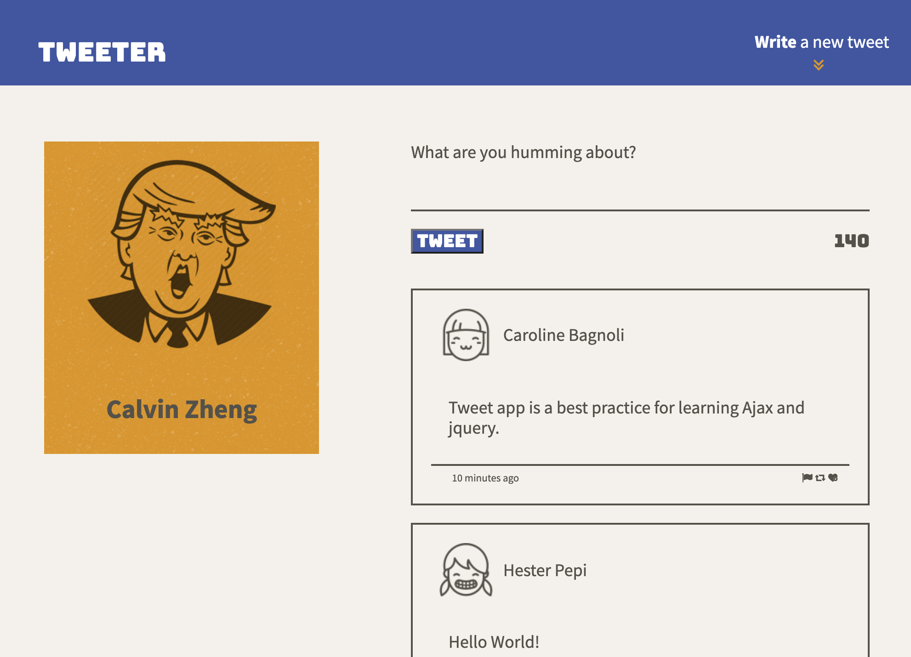

# Tweeter Project

Tweeter is a simple, single-page Twitter clone.

This repository is the starter code for the project: Students will fork and clone this repository, then build upon it to practice their HTML, CSS, JS, jQuery and AJAX front-end skills, and their Node, Express and MongoDB back-end skills.

## Getting Started

1. Fork this repository, then clone your fork of this repository.
2. Install dependencies using the `npm install` command.
3. Start the web server using the `npm run local` command. The app will be served at <http://localhost:8080/>.
4. Go to <http://localhost:8080/> in your browser.

## Dependencies

- Express
- body-parser
- chance
- Node 5.10.x or above
- md5

## Screenshots

## Features

- [X] New tweet post sliding down with animation
- [x] Hover shadow-effect on each tweet
- [x] Input chars limits checking
- [x] Tweet compose area toggles by clicking top button, textarea will be on focus when compose area appears
- [x] Downside arrow motion
- [x] Error message slide down by over input limits or tweeting empty content
- [x] Bottom button pop out by CSS3 keyframe animation when page scrolling up to centain position
- [x] Top button will disappear as long as bottom button showing up
- [x] Automatically Scrolling up to top with duration when clicking the bottom button
